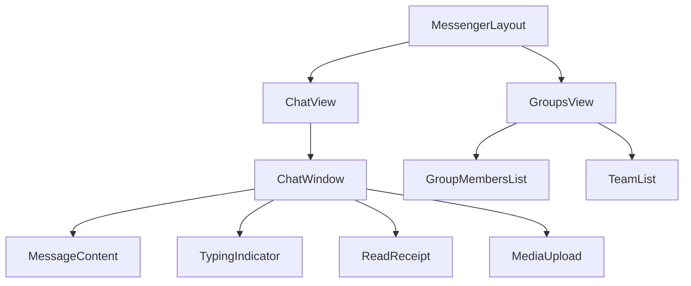

# Components Documentation

This document provides details about the React components located in the `src/components` directory.

## Layout Components

### MessengerLayout
- **`MessengerLayout.tsx`**: Main layout component that orchestrates the messaging interface
  - **`ChatView.tsx`**: Handles individual chat conversations, including message display and input
  - **`GroupsView.tsx`**: Manages group chat interfaces and group member interactions

### Navigation
- **`TopNavigation.tsx`**: Main navigation bar with user controls and app-wide actions
- **`Sidebar.tsx`**: Side navigation component for switching between different views

## Authentication & User Management

- **`AuthProvider.tsx`**: Authentication context provider that manages user session state and auth-related operations
- **`UserCard.tsx`**: Displays user information in a card format with status indicators
- **`ProfileSettings.tsx`**: User profile management interface for updating personal information
- **`UsernameDialog.tsx`**: Dialog for setting/updating username
- **`UserSearch.tsx`**: Search interface for finding other users in the application

## Messaging Components

- **`ChatWindow.tsx`**: Main chat interface component that displays messages and handles message input
  - Integrates with `MessageContent`, `TypingIndicator`, and `ReadReceipt`
  - Handles message sending, receiving, and history loading

- **`ChatHistory.tsx`**: Displays message history with infinite scroll support
- **`MessageContent.tsx`**: Renders different types of message content (text, media, links)
- **`ReadReceipt.tsx`**: Shows message read status with timestamps
- **`TypingIndicator.tsx`**: Displays real-time typing indicators for active chats

## Friend & Group Management

- **`FriendRequestButton.tsx`**: Button component for sending/managing friend requests
- **`FriendRequestItem.tsx`**: Individual friend request display with accept/reject actions
- **`FriendRequests.tsx`**: List of incoming friend requests
- **`SentFriendRequests.tsx`**: List of outgoing friend requests
- **`FriendsList.tsx`**: Displays and manages user's friends list
- **`CreateGroupModal.tsx`**: Modal for creating new group chats
- **`GroupMembersList.tsx`**: Displays and manages group chat members
- **`TeamList.tsx`**: Displays team/group list with management options

## Media Components

- **`MediaUpload.tsx`**: Handles file uploads with progress indication and preview
  - Supports images, videos, and other file types
  - Integrates with Firebase Storage
  - Provides upload progress feedback

## Error Handling

- **`ErrorBoundary.tsx`**: React error boundary for graceful error handling

## UI Components Library (`src/components/ui/`)

These components are built using Shadcn UI and are designed to be generic and reusable across different parts of the application.

### Input Components
- **`input.tsx`**: Text input fields
- **`input-otp.tsx`**: One-time password input for authentication
- **`textarea.tsx`**: Multi-line text input
- **`select.tsx`**: Dropdown selection lists
- **`checkbox.tsx`**: Boolean input selection
- **`radio-group.tsx`**: Mutually exclusive option selection
- **`switch.tsx`**: Toggle between two states
- **`slider.tsx`**: Range selection with sliding handle

### Interactive Elements
- **`button.tsx`**: Primary action elements
- **`toggle.tsx`**: Toggleable button states
- **`toggle-group.tsx`**: Grouped toggle buttons
- **`command.tsx`**: Command palettes/menus
- **`form.tsx`**: Form management and validation

### Navigation Components
- **`navigation-menu.tsx`**: Complex navigation with dropdowns
- **`menubar.tsx`**: Horizontal menu bars
- **`breadcrumb.tsx`**: Breadcrumb navigation
- **`pagination.tsx`**: Page navigation
- **`sidebar.tsx`**: Sidebar navigation layouts

### Layout Components
- **`accordion.tsx`**: Collapsible content panels
- **`aspect-ratio.tsx`**: Maintain content proportions
- **`card.tsx`**: Content grouping containers
- **`collapsible.tsx`**: Animated show/hide sections
- **`dialog.tsx`**: Modal dialogs
- **`drawer.tsx`**: Slide-in side panels
- **`resizable.tsx`**: Resizable elements
- **`scroll-area.tsx`**: Custom scrollbar areas
- **`separator.tsx`**: Content dividers
- **`sheet.tsx`**: Mobile-friendly modal sheets
- **`tabs.tsx`**: Tabbed content organization

### Feedback Components
- **`alert.tsx`**: Status messages
- **`alert-dialog.tsx`**: Confirmation dialogs
- **`progress.tsx`**: Process visualization
- **`skeleton.tsx`**: Loading placeholders
- **`toast.tsx`**: Individual notifications
- **`toaster.tsx`**: Notification management
- **`sonner.tsx`**: Toast notification system

### Data Display
- **`avatar.tsx`**: User profile pictures
- **`badge.tsx`**: Status/category indicators
- **`carousel.tsx`**: Rotating content displays
- **`chart.tsx`**: Data visualization
- **`table.tsx`**: Tabular data display

### Overlay Components
- **`context-menu.tsx`**: Right-click menus
- **`dropdown-menu.tsx`**: Option lists
- **`hover-card.tsx`**: Hover information
- **`popover.tsx`**: On-demand pop-up content
- **`tooltip.tsx`**: Informative tooltips

### Features
- Consistent theming system
- Accessibility compliance
- Responsive design
- Dark mode support
- Keyboard navigation
- ARIA attributes
- Focus management

### Usage Example
```typescript
import { Button } from "@/components/ui/button"
import { Input } from "@/components/ui/input"
import { toast } from "@/components/ui/use-toast"

function LoginForm() {
  return (
    <form onSubmit={handleSubmit}>
      <Input 
        type="email" 
        placeholder="Email"
        required 
      />
      <Button type="submit">
        Login
      </Button>
    </form>
  )
}
```

### Best Practices
1. Import components from ui/ directory
2. Use consistent component variants
3. Follow accessibility guidelines
4. Maintain responsive behavior
5. Handle loading/error states

## Component Relationships



## State Management

Most components integrate with the Zustand store (`store/messaging.ts`) for state management. Components use Firebase services through the service layer for data persistence and real-time updates.
