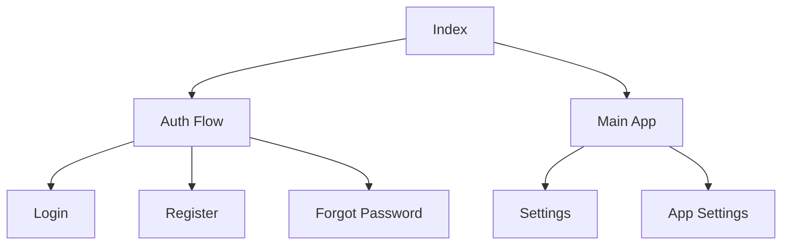

# Pages Documentation

This document details the React page components located in the `src/pages` directory, which define the application's routes and views.

## Main Pages

### Index Page (`Index.tsx`)
- Root route redirect component
- Redirects to home page ('/')
- Ensures consistent entry point

### Settings Pages

#### App Settings (`AppSettings.tsx`)
Dialog-based settings manager for application preferences.

**Features:**
- Appearance settings (Dark mode, Compact view)
- Notification preferences
- Privacy settings
- Modal interface with sectioned layout

```typescript
interface AppSettingsProps {
  open: boolean;
  onOpenChange: (open: boolean) => void;
}
```

#### User Settings (`Settings.tsx`)
Full-page settings view for user profile management.

**Features:**
- Profile information management
- Uses `ProfileSettings` component
- Container layout with standard spacing

## Authentication Pages (`auth/`)

### Login Page (`Auth.tsx`)
Main authentication page with multiple sign-in options.

**Features:**
- Email/password authentication
- Google OAuth integration
- Password reset link
- Registration redirect
- Error handling and validation

```typescript
// Authentication Methods
- Email/Password Sign In
- Google Sign In
- Form Validation
- Error Messaging
```

### Registration Page (`Register.tsx`)
New user account creation interface.

**Features:**
- Username selection with validation
- Email registration
- Password creation
- Username availability check
- Form validation and error handling

```typescript
// Validation Rules
Username:
- 3-20 characters
- Letters, numbers, underscores only
- Unique username check

Password:
- Minimum 6 characters
```

### Additional Auth Pages
- **`ForgotPassword.tsx`**: Password reset workflow
- **`AuthCallback.tsx`**: OAuth callback handling

## Error Pages

### Not Found (`NotFound.tsx`)
404 error page for unmatched routes.

## Page Hierarchy



## Routing Structure

```typescript
<Routes>
  <Route path="/" element={<MessengerLayout />} />
  <Route path="/auth" element={<Auth />} />
  <Route path="/register" element={<Register />} />
  <Route path="/settings" element={<Settings />} />
  <Route path="*" element={<NotFound />} />
</Routes>
```

## State Management

### Authentication State
- Managed through `AuthProvider`
- Persisted using Firebase Auth
- Guards for protected routes

### Settings State
- App settings stored locally
- User settings in Firestore
- Real-time sync for settings changes

## Best Practices

1. **Route Protection**
   - Authenticate before accessing protected routes
   - Redirect unauthorized users to login
   - Handle expired sessions

2. **Form Handling**
   - Client-side validation
   - Server-side validation
   - Clear error messages
   - Loading states

3. **Navigation**
   - Programmatic navigation after actions
   - Preserve state during navigation
   - Handle back/forward navigation

4. **Error Handling**
   - Firebase error mapping
   - User-friendly error messages
   - Network error handling
   - Retry mechanisms

## Usage Examples

1. **Protected Route Setup**
```typescript
function ProtectedRoute({ children }: { children: React.ReactNode }) {
  const { user, loading } = useAuth();
  
  if (loading) return <LoadingSpinner />;
  if (!user) return <Navigate to="/auth" />;
  
  return <>{children}</>;
}
```

2. **Settings Dialog**
```typescript
function SettingsButton() {
  const [open, setOpen] = useState(false);
  
  return (
    <>
      <Button onClick={() => setOpen(true)}>Settings</Button>
      <AppSettings open={open} onOpenChange={setOpen} />
    </>
  );
}
```

3. **Form Validation**
```typescript
function validateForm() {
  if (password.length < 6) {
    toast.error("Password must be at least 6 characters");
    return false;
  }
  return true;
}
```
